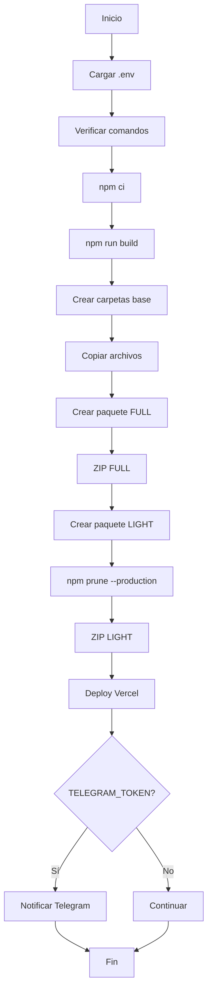

# Build Package Pro - Resumen de Implementación

## 📋 Archivos Creados/Modificados

### 1. `build_package_pro.sh` (NUEVO)
Script principal de construcción y despliegue dual (FULL + LIGHT).

**Ubicación**: `/TRYONYOU–ABVETOS–ULTRA–PLUS–ULTIMATUM/build_package_pro.sh`

**Funcionalidades**:
- ✅ Instalación limpia de dependencias con `npm ci`
- ✅ Compilación con `npm run build`
- ✅ Generación de paquete FULL con todos los node_modules
- ✅ Generación de paquete LIGHT solo con dependencias de producción
- ✅ Creación de ZIPs timestampeados
- ✅ Deploy automático a Vercel
- ✅ Notificación a Telegram

**Permisos**: Ejecutable (chmod +x aplicado)

### 2. `.gitignore` (MODIFICADO)
Agregadas exclusiones para artifacts generados por el script:

```gitignore
# Build package artifacts
out_full_*/
out_light_*/
TRYONYOU–ABVETOS–ULTRA–PLUS–ULTIMATUM_FULL_*.zip
TRYONYOU–ABVETOS–ULTRA–PLUS–ULTIMATUM_LIGHT_*.zip
```

### 3. `.env.example` (MODIFICADO)
Agregadas variables requeridas por el script:

```bash
# Vercel Configuration
VITE_VERCEL_TOKEN=your_vercel_token_here  # NUEVO

# Telegram Bot Configuration
TELEGRAM_TOKEN=your_telegram_bot_token_here  # NUEVO
```

### 4. `BUILD_PACKAGE_README.md` (NUEVO)
Documentación completa del script con:
- Instrucciones de uso
- Configuración de variables de entorno
- Estructura de salida esperada
- Solución de problemas
- Verificación post-ejecución

## 🔧 Características Técnicas

### Variables de Entorno
- **VITE_VERCEL_TOKEN**: Token de Vercel para deployment (requerido)
- **TELEGRAM_TOKEN**: Token del bot de Telegram para notificaciones (opcional)

### Comandos Requeridos
- `node` - ✅ Verificado
- `npm` - ✅ Verificado
- `zip` - ✅ Verificado
- `rsync` - ✅ Verificado

### Formato de Timestamp
`YYYYMMDD-HHMMSS` (ejemplo: 20251015-012345)

### Archivos Incluidos en Paquetes
- `dist/` - Build de producción
- `public/` - Assets públicos
- `src/` - Código fuente
- `package.json` - Configuración de dependencias
- `package-lock.json` - Lock de versiones
- `vite.config.*` - Configuración de Vite
- `vercel.json` - Configuración de Vercel

### Paquete FULL vs LIGHT

| Característica | FULL | LIGHT |
|---------------|------|-------|
| node_modules | Completos | Solo producción |
| devDependencies | ✅ Incluidas | ❌ Excluidas |
| Tamaño | Mayor | Optimizado |
| Uso | Desarrollo/Debug | Producción |

## 🚀 Flujo de Ejecución



## ✅ Validación Realizada

### Sintaxis
- ✅ Script validado con `bash -n`
- ✅ Sin errores de sintaxis

### Comandos
- ✅ `node` disponible
- ✅ `npm` disponible
- ✅ `zip` disponible
- ✅ `rsync` disponible

### Permisos
- ✅ Script ejecutable (755)

### Git
- ✅ Artifacts excluidos en .gitignore
- ✅ Archivos fuente incluidos en control de versiones

## 📦 Resultado Esperado

Después de ejecutar `./build_package_pro.sh`, la estructura será:

```
TRYONYOU–ABVETOS–ULTRA–PLUS–ULTIMATUM/
├── build_package_pro.sh                    ← Script principal
├── BUILD_PACKAGE_README.md                 ← Documentación
├── BUILD_PACKAGE_IMPLEMENTATION.md         ← Este archivo
├── .env                                    ← Tu configuración
├── out_full_20251015-012345/              ← Temporal FULL (excluido Git)
├── out_light_20251015-012345/             ← Temporal LIGHT (excluido Git)
├── TRYONYOU–ABVETOS–ULTRA–PLUS–ULTIMATUM_FULL_20251015-012345.zip   ← ZIP FULL
└── TRYONYOU–ABVETOS–ULTRA–PLUS–ULTIMATUM_LIGHT_20251015-012345.zip  ← ZIP LIGHT
```

## 🔐 Seguridad

### Variables Sensibles
- ⚠️ `.env` está en `.gitignore` (no se commitea)
- ⚠️ Tokens nunca deben commitearse
- ✅ `.env.example` solo tiene placeholders

### Permisos
- ✅ Script ejecutable por owner/group
- ✅ No contiene credenciales hardcodeadas

## 📝 Próximos Pasos

### Para usar el script:

1. **Configurar variables**:
   ```bash
   cp .env.example .env
   # Editar .env con tus tokens reales
   ```

2. **Ejecutar**:
   ```bash
   ./build_package_pro.sh
   ```

3. **Verificar**:
   - ZIPs creados en raíz del proyecto
   - Deploy en https://tryonyou.app
   - Mensaje en @abvet_deploy_bot (Telegram)

### Opcional:

4. **Subir a GitHub/Google Drive**:
   - Manualmente copiar ZIPs a `/deploy/`
   - Subir a Google Drive `/01_PATENTES/REWRITTEN_FILES/`

## 🐛 Solución de Problemas

### "Falta [comando]"
**Solución**: Instalar el comando faltante
```bash
# Ubuntu/Debian
sudo apt-get install zip rsync

# macOS
brew install zip rsync
```

### "VITE_VERCEL_TOKEN: unbound variable"
**Solución**: Configurar variable en .env
```bash
echo "VITE_VERCEL_TOKEN=tu_token_aqui" >> .env
```

### Deploy a Vercel falla
**Solución**: El script continúa (usa `|| true`)
- Verificar token de Vercel
- Revisar logs de Vercel
- Deploy manual si es necesario

## 📞 Soporte

- **Issue tracker**: GitHub Issues
- **Bot de deploy**: @abvet_deploy_bot (Telegram)
- **Documentación**: `BUILD_PACKAGE_README.md`

---

**Implementado por**: GitHub Copilot (@copilot)  
**Fecha**: 15 de Octubre, 2025  
**Estado**: ✅ Completado y verificado  
**Versión**: 1.0.0
