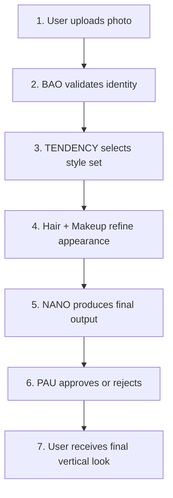

# 🚀 TRYONME / TRYONYOU — AVBETOS Intelligence System

> Master Document — AVBETOS Intelligence System

---

## 📋 Table of Contents

1. [Executive Summary](#1-executive-summary)
2. [Product Value Proposition](#2-product-value-proposition)
3. [AVBETOS Intelligence System (Core Modules)](#3-avbetos-intelligence-system-core-modules)
4. [End-to-End Pipeline Flow](#4-end-to-end-pipeline-flow)
5. [Vertical Look Spec (9:16)](#5-vertical-look-spec-916)
6. [Demo](#6-demo-express-deploy)
7. [Landing Page Structure](#7-landing-page-structure)
8. [UX/UI Specs](#8-ux--ui-specs)
9. [Tech Architecture](#9-tech-architecture)
10. [Testing Checklist](#10-testing-checklist-pre-sales)
11. [Business Use Cases](#11-business-use-cases)
12. [Roadmap (Next 90 Days)](#12-roadmap-next-90-days)
13. [Sales Pitch Snippet](#13-sales-pitch-snippet-30-seconds)
14. [Final Status](#14-final-status)

---

## 1. Executive Summary

**TRYONME / TRYONYOU** is a next-generation avatar and styling engine powered by the **AVBETOS Intelligence System**.

It transforms a simple real photo into an **editorial-grade, natural, elegant, and enhanced representation** of the user — while preserving true identity.

- ✖️ Not generic AI.
- ✖️ Not filters.
- ✖️ Not distortion.
- ✅ **Creative Direction + Machine Intelligence.**

Fully optimized for mobile, fashion, beauty, retail, and identity tech.

---

## 2. Product Value Proposition

### **You deserve to look stunning.**

TRYONME / TRYONYOU enables:

| Feature | Description |
|---------|-------------|
| 🖼️ **Ultra-realistic avatars** | Photorealistic digital representations |
| 🎨 **Stylized looks** | Aesthetic coherence in every output |
| ✨ **Premium beige editorial lighting** | Studio-quality illumination |
| 🪪 **Identity-preserving transformations** | Your face, your identity, enhanced |
| 👗 **Complete try-on vertical experience** | Full-body fashion visualization |
| 🔗 **API integration for brands** | Seamless B2B integration |

> **This is the first avatar system that enhances without inventing.**

---

## 3. AVBETOS Intelligence System (Core Modules)

### 🔵 BAO — Identity Integrity Engine
Keeps the user's facial identity consistent and undistorted.

### 🟠 TENDENCY — Style & Aesthetic Director
Determines color palettes, silhouettes, styling rules.

### 🟣 ROYAL HAIR — Editorial Hair System
Natural, premium, directional hair refinement.

### 💗 ROYAL MAKEUP — Realistic Beauty Engine
Skin retouch, lighting balance, photo-grade makeup.

### 🟡 NANO RENDER — Editorial Rendering Engine
Beige studio lighting, soft shadows, premium tonality.

### 🔴 PAU — Virtual Art Director
Final approval stage: checks dignity, coherence, beauty, realism.

### ⚫ ORCHESTRATOR — Pipeline Manager
Executes full chain in correct order:

```
Bao → Tendency → Hair → Makeup → Nano → Pau
```

---

## 4. End-to-End Pipeline Flow



| Step | Module | Action |
|------|--------|--------|
| 1 | Input | User uploads photo |
| 2 | BAO | Validates identity |
| 3 | TENDENCY | Selects style set |
| 4 | Hair + Makeup | Refine appearance |
| 5 | NANO | Produces final output |
| 6 | PAU | Approves or rejects |
| 7 | Output | User receives final vertical look |

---

## 5. Vertical Look Spec (9:16)

| Property | Value |
|----------|-------|
| Background | Uniform beige `#EFE7DE` |
| Composition | Full body centered |
| Lighting | No visible ceiling lights |
| Ambient | Editorial gradient ambient |

### Top Bar
```
PAU recommends:  • Elegant  • Minimal  • Red
```

### UI Requirements
- Clean UI
- CTA: "Try the demo"

---

## 6. Demo (Express Deploy)

### Demo URL
```
https://YOUR-DEMO-HERE.com
```

### Demo showcases:
- ✅ Real identity retention
- ✅ Live styling engine
- ✅ Vertical output quality
- ✅ Premium aesthetic pipeline
- ✅ Mobile seamless performance

---

## 7. Landing Page Structure

### Hero Section
> **You deserve to look stunning.**
>
> Your real avatar. Your best version. Editorial intelligence for fashion & beauty.
>
> **CTA** → Try the demo

### Benefits
- 🎯 Realistic avatars
- 🎨 Coherent styling
- ✨ Luxury editorial output
- 📱 Mobile-first experience
- 🛒 Ready for commerce & identity

### Final CTA
> **Don't let them tell you. Live it.**
>
> **Try the demo →**

---

## 8. UX / UI Specs

### Mobile First
| Property | Specification |
|----------|---------------|
| Aspect Ratio | Vertical 9:16 |
| Avatar | Crisp scaling |
| Color Scheme | Clean beige tones |
| Quality | Zero artifacts |
| Interaction | Touch-friendly CTA |

### Top Bar (final image screen)
```
PAU recommends:  • Elegant  • Minimal  • Red
```

### Look Screen
- Full body
- Soft shadows
- Editorial lighting
- No UI clutter

---

## 9. Tech Architecture

### Frontend
- **Framework:** Next.js / React
- **Layout:** Mobile-first layout
- **Pages:** Landing + demo UI
- **Style:** Clean components

### Backend
- AVBETOS micro-modules
- Identity + styling pipeline
- Rendering node
- Approval engine (PAU)

### Image Engine
- High-fidelity rendering
- Lighting normalization
- Color + tone mapping
- Texture preservation

### Scalability
- Stateless orchestrator
- GPU-friendly stages
- Modular upgrades

---

## 10. Testing Checklist (Pre-Sales)

- [ ] Demo loads in <2s
- [ ] Mobile Safari works
- [ ] Mobile Chrome works
- [ ] Desktop browsers work
- [ ] Vertical look centered
- [ ] No ceiling lamp visible
- [ ] Background uniform
- [ ] CTA functional
- [ ] No UI breaking on small screens
- [ ] Pipeline Bao → Pau executes fully

---

## 11. Business Use Cases

| Use Case | Description |
|----------|-------------|
| 👗 Digital fashion try-on | Virtual outfit previews |
| 🛍️ E-commerce outfit previews | Product visualization |
| 💄 Beauty and makeup experiences | Cosmetics try-on |
| 📸 Editorial identity photos | Professional portraits |
| 🌟 Influencer content generation | Social media assets |
| 👤 Creator premium avatars | Digital identities |
| 🪪 Digital passport / profile identity | ID verification |

---

## 12. Roadmap (Next 90 Days)

### Phase 1 — December
- ✅ Demo live
- ✅ Landing ready for sales
- ✅ Investor-ready documentation
- 🔄 Stabilize AVBETOS pipeline
- 🔄 Pau approval consistency

### Phase 2 — January
- 📋 API for brands
- 📋 Batch rendering
- 📋 User accounts
- 📋 Full wardrobe presets
- 📋 Mobile app alpha

### Phase 3 — February
- 📋 Marketplace integrations
- 📋 Custom fashion catalogs
- 📋 Brand partner onboarding
- 📋 Hair + Makeup v2
- 📋 Nano Render 2.0 (cinematic)

---

## 13. Sales Pitch Snippet (30 seconds)

> *"TRYONME / TRYONYOU is not a filter.*
> *It is editorial intelligence for your identity.*
>
> *BAO keeps who you are.*
> *TENDENCY defines how you dress.*
> *Royal Hair and Makeup prepare you like a photoshoot.*
> *Nano gives the final editorial look.*
> *PAU approves it.*
>
> *The result:*
> *You look stunning. Real.*
> *Ready for any outfit in the world.*
>
> **Try the demo."**

---

## 14. Final Status

| Status | Description |
|--------|-------------|
| ✅ | **READY FOR PRESENTATION** |
| ✅ | **READY FOR SALES** |
| ✅ | **READY FOR TOMORROW** |

---

## Getting Started

### Prerequisites
- Node.js 18+
- npm or yarn

### Installation
```bash
npm install
```

### Development
```bash
npm run dev
```

### Build
```bash
npm run build
```

### Preview
```bash
npm run preview
```

---

## License

Proprietary — TRYONME / TRYONYOU © 2024

---

> **This is the MASTER DOCUMENT of TRYONME / TRYONYOU — AVBETOS.**
> **The central piece of the project.**
