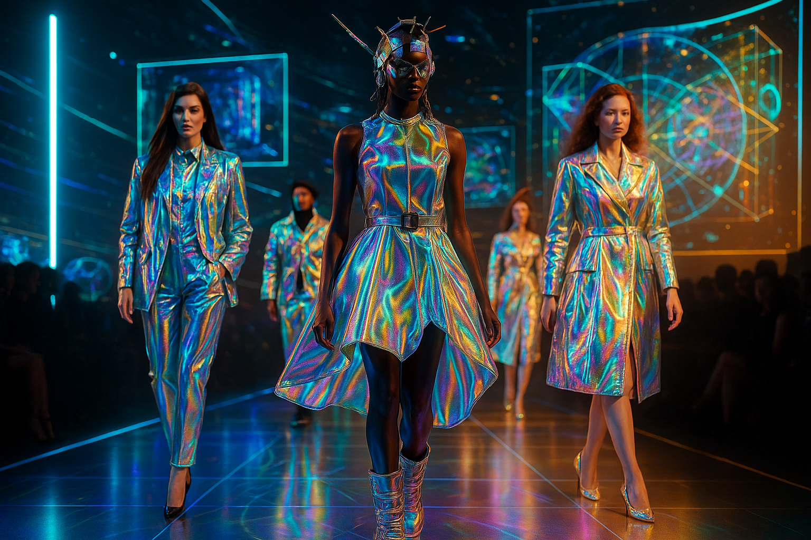
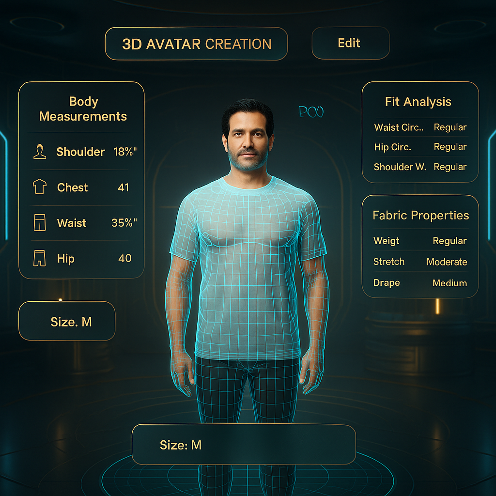
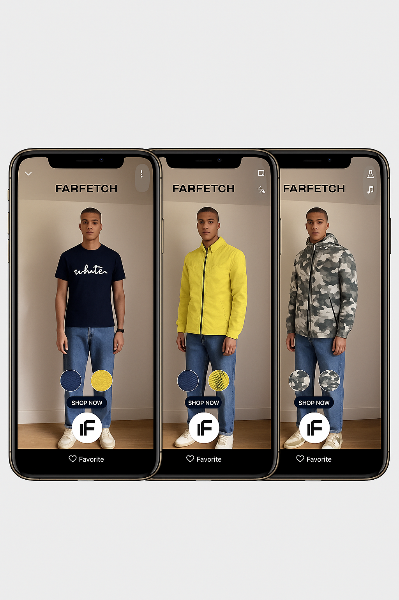
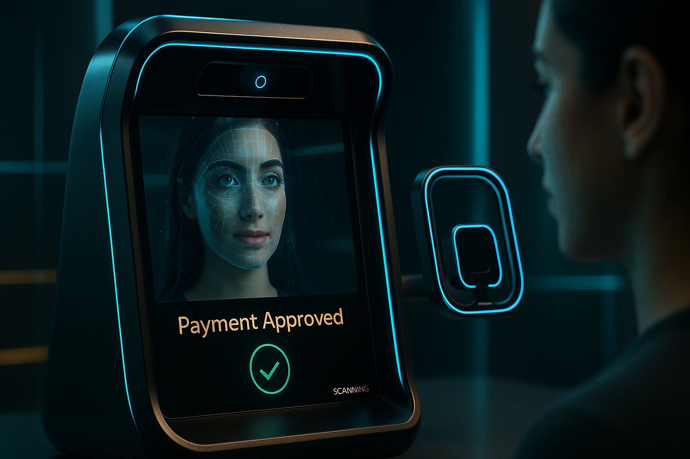

# TRYONYOU – ABVETOS – ULTRA–PLUS–ULTIMATUM

**The Future of Fashion Intelligence is Here.**

TRYONYOU is a revolutionary fashion technology platform that redefines the virtual try-on experience. Our intelligent, modular, and scalable system combines advanced AI, 3D avatar generation, and biometric payments to deliver a seamless and personalized fashion journey.

https://github.com/LVT-ENG/TRYONME-TRYONYOU-ABVETOS--INTELLIGENCE--SYSTEM/assets/178423938/531055c3-1492-4161-a1c1-52591e01083e

## Key Features

Our platform is built on a foundation of cutting-edge modules that work in harmony to create an unparalleled user experience.

| Module | Description |
| --- | --- |
| **Avatar 3D** | Generate photorealistic 3D avatars with precise body measurements for a perfect fit. |
| **Fabric Fit Comparator** | Simulate how different fabrics and garments will look and feel on your unique avatar. |
| **Smart Wardrobe** | Digitize your closet, get AI-powered outfit recommendations, and rediscover your style. |
| **Solidarity Wardrobe** | Participate in a sustainable fashion ecosystem by donating or exchanging clothing. |
| **ABVET Biometric Payment** | Experience secure, frictionless payments with advanced iris and voice recognition. |
| **Fashion Trend Tracker (FTT)** | Stay ahead of the curve with real-time trend analysis powered by AI. |
| **Creative Auto-Production (CAP)** | Bring your designs to life with our automated, on-demand production system. |
| **LiveIt Factory Orchestration** | Optimize your supply chain with our intelligent factory management platform. |

## A Visual Journey into the Future of Fashion

Experience the power of TRYONYOU through our immersive visual content, showcasing the platform's futuristic aesthetic and cutting-edge technology.

### Holographic Fashion Runway

Step into a world where fashion meets the future. Our holographic runway showcases iridescent, color-shifting garments that flow like liquid light, offering a glimpse into the next generation of fashion.



https://github.com/LVT-ENG/TRYONME-TRYONYOU-ABVETOS--INTELLIGENCE--SYSTEM/assets/178423938/8050608c-9892-441d-839b-8321920830a3

### 3D Avatar Generation

Create your digital twin with our advanced 3D avatar generation system. Input your measurements and watch as a photorealistic avatar is created, ready for a virtual fitting.



https://github.com/LVT-ENG/TRYONME-TRYONYOU-ABVETOS--INTELLIGENCE--SYSTEM/assets/178423938/0389312b-3a31-4797-862a-0e70036328a9

### Virtual Try-On Interface

Experience the most realistic virtual try-on solution available. Our interface allows you to see how different garments fit and move on your 3D avatar, all from the comfort of your home.



https://github.com/LVT-ENG/TRYONME-TRYONYOU-ABVETOS--INTELLIGENCE--SYSTEM/assets/178423938/0c19a99c-3e3a-4e2d-905c-1961225a1b5c

### Biometric Payment System

Checkout with a glance. Our ABVET biometric payment system uses advanced iris and facial recognition to provide a secure and seamless payment experience.



https://github.com/LVT-ENG/TRYONME-TRYONYOU-ABVETOS--INTELLIGENCE--SYSTEM/assets/178423938/77488835-212c-471a-b3c0-0d30241a6341

## Project Structure

Our repository is organized to ensure clarity, scalability, and ease of maintenance.

```
├── .env.example
├── .gitignore
├── LICENSE
├── Makefile
├── README.md
├── deploy.sh
├── docs/
│   ├── arquitectura.md
│   ├── casos_uso.md
│   └── flujo_usuario.md
├── package.json
├── src/
│   ├── index.js
│   ├── modules/
│   └── utils/
├── tests/
└── vercel.json
```

## Getting Started

To get started with the TRYONYOU platform, please refer to our detailed documentation:

- [**Architecture Overview**](docs/arquitectura.md)
- [**User Flow**](docs/flujo_usuario.md)
- [**Use Cases**](docs/casos_uso.md)

## The 50 Intelligent Agents of TRYONYOU

Our platform is powered by a suite of 50 intelligent agents that automate and optimize every aspect of the fashion lifecycle. Discover the full list of agents and their capabilities in our [**Agent Documentation**](docs/agentes.md).

