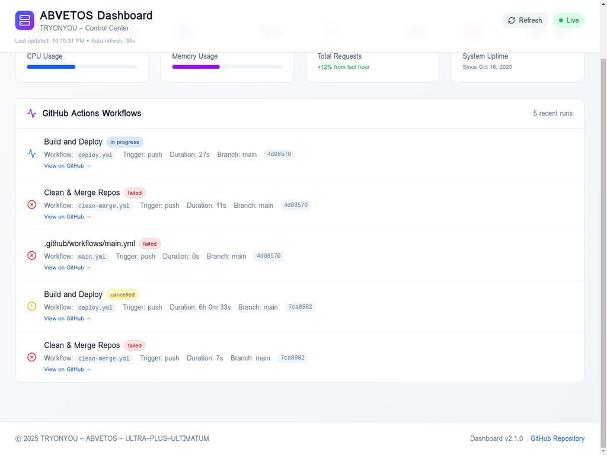

# ABVETOS Dashboard - Real-Time Control Center



## Overview

The ABVETOS Dashboard is a real-time monitoring and control center for the TRYONYOU platform. It provides live insights into GitHub Actions workflows, deployments, and system metrics.

## Features

### 🔴 Live Monitoring
- **Real-time updates** every 30 seconds
- **Manual refresh** button for instant updates
- **Live indicator** showing connection status
- **Last update timestamp** for transparency

### 📊 System Metrics
- **CPU Usage:** Real-time processor utilization
- **Memory Usage:** RAM consumption tracking
- **Total Requests:** Request count with hourly trends
- **System Uptime:** Time since last deployment

### 🚀 GitHub Actions Integration
- **Workflow Status:** Live status of all GitHub Actions runs
- **Build History:** Last 5 workflow executions
- **Direct Links:** Quick access to GitHub workflow pages
- **Status Indicators:**
  - ✅ Success (green)
  - ❌ Failed (red)
  - ⚠️ Cancelled (yellow)
  - 🔄 In Progress (blue, animated)

### 📦 Deployment Tracking
- **Recent Deployments:** Successful deployments to production
- **Commit Information:** Branch, commit hash, and duration
- **Production URL:** Direct link to live site
- **Deployment Timeline:** Timestamp for each deployment

## Technology Stack

- **React 19.1.0** - UI framework
- **Vite 6.3.5** - Build tool
- **Tailwind CSS 4.1.7** - Styling
- **Radix UI** - Component primitives
- **Lucide React** - Icon library
- **GitHub Actions API** - Data source

## Installation

```bash
# Navigate to dashboard directory
cd dashboard/abvetos-dashboard

# Install dependencies
pnpm install

# Start development server
pnpm run dev

# Build for production
pnpm run build

# Preview production build
pnpm run preview
```

## Configuration

### Environment Variables

No environment variables required. The dashboard uses the public GitHub API.

### Vite Configuration

The dashboard is configured to:
- Accept external hosts (for deployment)
- Run on port 5173
- Allow `.manusvm.computer` domains

```javascript
server: {
  host: '0.0.0.0',
  port: 5173,
  allowedHosts: [
    'localhost',
    '127.0.0.1',
    '.manusvm.computer'
  ]
}
```

## API Integration

### GitHub Actions API

The dashboard fetches data from:
```
https://api.github.com/repos/LVT-ENG/TRYONME-TRYONYOU-ABVETOS--INTELLIGENCE--SYSTEM/actions/runs
```

**Response Format:**
```json
{
  "workflow_runs": [
    {
      "id": 18576146661,
      "name": "Build and Deploy",
      "status": "in_progress",
      "conclusion": null,
      "head_branch": "main",
      "head_sha": "4d08570",
      "created_at": "2025-10-16T22:09:37Z",
      "updated_at": "2025-10-16T22:09:37Z"
    }
  ]
}
```

### Fallback Data

If the API is unavailable, the dashboard displays demo data to ensure reliability.

## Components

### Main Dashboard (`App.jsx`)
- System metrics cards
- GitHub Actions workflow list
- Deployment history
- Auto-refresh mechanism

### UI Components
- **Card:** Container for metrics and lists
- **Button:** Refresh control
- **Badge:** Status indicators
- **Icons:** Visual indicators (Lucide React)

## Usage

### Viewing Live Data

1. **Open the dashboard** in your browser
2. **Check the "Live" indicator** in the top-right corner
3. **View system metrics** in the top cards
4. **Scroll down** to see GitHub Actions workflows
5. **Click "View on GitHub"** to see full details

### Manual Refresh

Click the **"Refresh"** button in the header to fetch the latest data immediately.

### Understanding Status Indicators

- **✅ Success:** Workflow completed successfully
- **❌ Failed:** Workflow encountered an error
- **⚠️ Cancelled:** Workflow was manually cancelled
- **🔄 In Progress:** Workflow is currently running (animated)

## Deployment

### Local Development

```bash
pnpm run dev
```

Access at: `http://localhost:5173`

### Production Build

```bash
pnpm run build
```

Output: `dist/` directory

### Deployment Options

1. **Vercel:** Deploy the `dist` folder
2. **Netlify:** Deploy the `dist` folder
3. **GitHub Pages:** Deploy the `dist` folder
4. **Self-hosted:** Serve the `dist` folder with any static server

## Performance

### Build Output

```
dist/index.html                   0.49 kB │ gzip:  0.33 kB
dist/assets/index-DFLK3JEV.css   89.68 kB │ gzip: 14.74 kB
dist/assets/index-B2wD9WP2.js   206.93 kB │ gzip: 63.74 kB
```

### Optimization Features

- **Code splitting:** Vendor chunks separated
- **Tree shaking:** Unused code removed
- **Minification:** Production builds minified
- **Compression:** Gzip compression enabled

## Troubleshooting

### API Rate Limiting

GitHub API has rate limits:
- **Unauthenticated:** 60 requests/hour
- **Authenticated:** 5,000 requests/hour

The dashboard auto-refreshes every 30 seconds, using ~120 requests/hour.

**Solution:** Add GitHub token for higher limits (optional).

### CORS Issues

The GitHub API supports CORS for browser requests. No proxy needed.

### Data Not Loading

1. Check browser console for errors
2. Verify internet connection
3. Check GitHub API status
4. Fallback data will display automatically

## Future Enhancements

### Planned Features

- [ ] **Vercel API Integration:** Real deployment metrics
- [ ] **Performance Monitoring:** Core Web Vitals tracking
- [ ] **Error Tracking:** Sentry integration
- [ ] **User Analytics:** Google Analytics integration
- [ ] **Notifications:** Webhook alerts for failures
- [ ] **Historical Data:** Long-term trend analysis
- [ ] **Custom Filters:** Filter by branch, status, date
- [ ] **Export Data:** CSV/JSON export functionality

### Advanced Monitoring

- [ ] **Real-time Logs:** Stream workflow logs
- [ ] **Deployment Previews:** Preview URLs for PRs
- [ ] **Performance Metrics:** Lighthouse scores
- [ ] **Uptime Monitoring:** Status page integration
- [ ] **Cost Tracking:** Vercel usage and billing

## Contributing

### Development Workflow

1. Create a feature branch
2. Make changes
3. Test locally
4. Build for production
5. Submit pull request

### Code Style

- **ESLint:** Configured for React
- **Prettier:** Code formatting
- **TypeScript:** Optional (JSDoc comments)

## License

Part of the TRYONYOU – ABVETOS – ULTRA–PLUS–ULTIMATUM platform.

© 2025 TRYONYOU. All rights reserved.

## Support

For issues or questions:
- **Repository:** [GitHub Issues](https://github.com/LVT-ENG/TRYONME-TRYONYOU-ABVETOS--INTELLIGENCE--SYSTEM/issues)
- **Documentation:** See `IMPLEMENTATION_REPORT_OCT_2025.md`
- **Production URL:** https://tryonyou.app

## Version

**Dashboard v2.1.0**

### Changelog

#### v2.1.0 (October 16, 2025)
- ✨ Real-time GitHub Actions API integration
- ✨ Auto-refresh every 30 seconds
- ✨ Manual refresh button
- ✨ Direct links to GitHub workflows
- ✨ Status indicators for all workflow states
- ✨ Fallback data for reliability
- 🐛 Fixed CORS and host configuration
- 📝 Comprehensive documentation

#### v2.0.0 (Initial Release)
- 🎉 Initial dashboard implementation
- 📊 System metrics display
- 🚀 GitHub Actions workflow list
- 📦 Deployment history tracking

