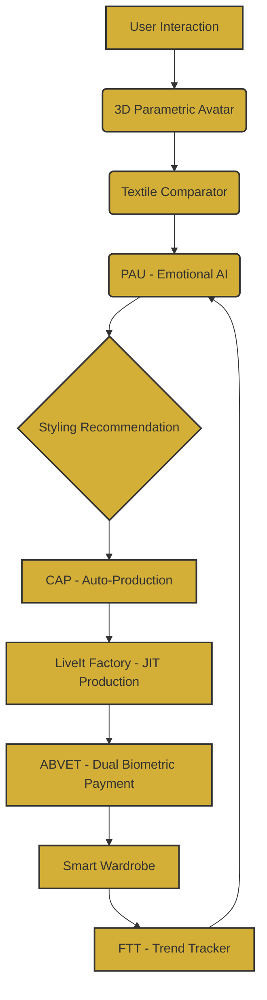

```mermaid
graph TD
    A[User Interaction] --> B(3D Parametric Avatar);
    B --> C(Textile Comparator);
    C --> D(PAU - Emotional AI);
    D --> E{Styling Recommendation};
    E --> F[CAP - Auto-Production];
    F --> G[LiveIt Factory - JIT Production];
    G --> H[ABVET - Dual Biometric Payment];
    H --> I[Smart Wardrobe];
    I --> J[FTT - Trend Tracker];
    J --> D;
    style A fill:#D4AF37,stroke:#333,stroke-width:2px
    style H fill:#D4AF37,stroke:#333,stroke-width:2px
    style I fill:#D4AF37,stroke:#333,stroke-width:2px
    style J fill:#D4AF37,stroke:#333,stroke-width:2px
    style D fill:#D4AF37,stroke:#333,stroke-width:2px
    style E fill:#D4AF37,stroke:#333,stroke-width:2px
    style F fill:#D4AF37,stroke:#333,stroke-width:2px
    style G fill:#D4AF37,stroke:#333,stroke-width:2px
    style B fill:#D4AF37,stroke:#333,stroke-width:2px
    style C fill:#D4AF37,stroke:#333,stroke-width:2px
```
