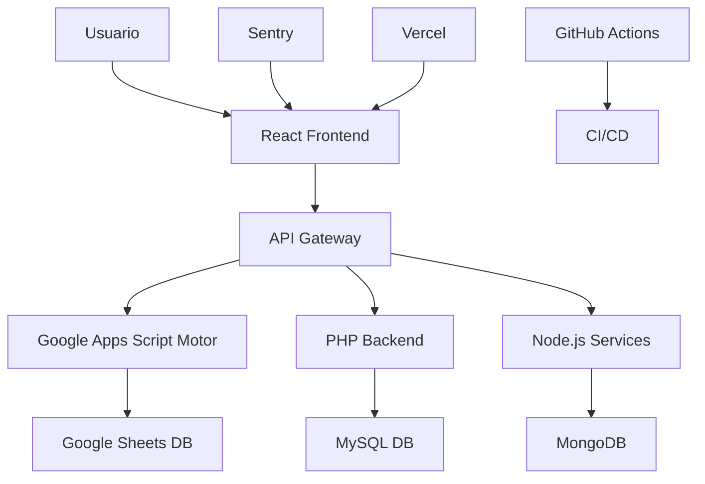

# Guía de Desarrollo

Guía completa para desarrolladores que trabajan en el sistema TryOnMe / TryOnYou - AVBETOS Intelligence System.

## 🏗️ Arquitectura del Sistema

### Visión General



### Componentes Principales

1. **Frontend**: React + Vite + Framer Motion
2. **Motor de Recomendaciones**: Google Apps Script
3. **API Backend**: PHP + Node.js
4. **Base de Datos**: Google Sheets (prototipo) + MySQL/MongoDB (producción)
5. **Observabilidad**: Sentry + Métricas personalizadas
6. **CI/CD**: GitHub Actions + Vercel

## 🚀 Configuración del Entorno de Desarrollo

### Prerrequisitos

```bash
# Node.js y npm
node --version  # v18+
npm --version   # v9+

# Git
git --version

# PHP (para backend)
php --version   # v8.0+

# Composer (para dependencias PHP)
composer --version
```

### Instalación

```bash
# 1. Clonar el repositorio
git clone https://github.com/LVT-ENG/TRYONME-TRYONYOU-ABVETOS--INTELLIGENCE--SYSTEM.git
cd TRYONME-TRYONYOU-ABVETOS--INTELLIGENCE--SYSTEM

# 2. Instalar dependencias de Node.js
npm install

# 3. Instalar dependencias PHP (si existe composer.json)
composer install

# 4. Copiar archivos de configuración
cp .env.example .env
cp tryonu-app/.env.example tryonu-app/.env.local

# 5. Configurar variables de entorno (ver sección siguiente)
```

### Variables de Entorno

#### Archivo `.env` (raíz del proyecto)
```bash
# Entorno
NODE_ENV=development

# Base de datos
DB_HOST=localhost
DB_PORT=3306
DB_NAME=tryonme_dev
DB_USER=root
DB_PASS=

# Google Apps Script
GOOGLE_SCRIPT_ID=your_script_id
GOOGLE_API_KEY=your_api_key

# APIs externas
FASHION_API_KEY=your_fashion_api_key
BIOMETRIC_API_KEY=your_biometric_api_key

# Pagos (Stripe)
STRIPE_SECRET_KEY=sk_test_...
STRIPE_PUBLISHABLE_KEY=pk_test_...

# Email
SENDGRID_API_KEY=your_sendgrid_key
SMTP_HOST=localhost
SMTP_PORT=587

# Observabilidad
SENTRY_DSN=your_sentry_dsn
SLACK_WEBHOOK_URL=your_slack_webhook

# Vercel
VERCEL_TOKEN=your_vercel_token
VERCEL_PROJECT_ID=your_project_id
```

#### Archivo `tryonu-app/.env.local` (Frontend React)
```bash
# Sentry Frontend
VITE_SENTRY_DSN=https://your-key@sentry.io/project-id
VITE_ENVIRONMENT=development
VITE_APP_VERSION=1.0.0

# APIs
VITE_API_BASE_URL=http://localhost:3000/api
VITE_HEALTH_URL=http://localhost/health.php

# Stripe Frontend
VITE_STRIPE_PUBLISHABLE_KEY=pk_test_...

# Google Analytics (opcional)
VITE_GA_TRACKING_ID=GA_MEASUREMENT_ID
```

## 💻 Comandos de Desarrollo

### Scripts Disponibles

```bash
# Desarrollo frontend
npm run dev              # Servidor de desarrollo (puerto 5173)
npm run build           # Construcción para producción
npm run preview         # Vista previa de la construcción

# Linting y validación
npm run lint:commits    # Validar commits convencionales
npm run lint:js         # Linter JavaScript/TypeScript
npm run lint:css        # Linter CSS

# Testing
npm test               # Ejecutar tests
npm run test:watch     # Tests en modo watch
npm run test:coverage  # Coverage de tests

# Google Apps Script
./scripts/deploy-gas.sh    # Desplegar a Google Apps Script
./scripts/test-gas.sh      # Probar funciones de Google Apps Script

# Base de datos
./scripts/db-migrate.sh    # Ejecutar migraciones
./scripts/db-seed.sh       # Poblar base de datos con datos de prueba

# Observabilidad
./test-alerting.sh         # Probar sistema de alertas
./validate-observability.sh   # Validar métricas y monitoring
```

### Flujo de Trabajo de Desarrollo

```bash
# 1. Crear rama para nueva funcionalidad
git checkout -b feat/nueva-funcionalidad

# 2. Hacer cambios y commits siguiendo convenciones
git add .
git commit -m "feat(ui): add user profile component"

# 3. Ejecutar tests localmente
npm test
npm run lint:commits

# 4. Subir cambios
git push origin feat/nueva-funcionalidad

# 5. Crear Pull Request
# GitHub automáticamente ejecutará CI/CD
```

## 🏗️ Estructura del Código

### Organización de Directorios

```
├── .github/                     # GitHub Actions y templates
│   ├── workflows/              # Pipelines CI/CD
│   ├── ISSUE_TEMPLATE/         # Templates de issues
│   └── pull_request_template.md
├── docs/                       # Documentación
│   ├── API.md                  # Documentación de API
│   ├── USER_GUIDE.md           # Guía de usuario
│   └── DEVELOPER_GUIDE.md      # Esta guía
├── google-apps-script/         # Motor de recomendaciones
│   ├── motor.gs                # Lógica principal
│   ├── helpers.gs              # Funciones auxiliares
│   ├── utils.gs                # Utilidades
│   └── DEPLOYMENT.md           # Guía de despliegue
├── tryonu-app/                 # Aplicación React
│   ├── src/
│   │   ├── components/         # Componentes React
│   │   ├── hooks/              # React hooks personalizados
│   │   ├── services/           # Servicios y APIs
│   │   ├── utils/              # Utilidades
│   │   └── styles/             # Estilos CSS/SCSS
│   ├── public/                 # Archivos estáticos
│   └── vite.config.js          # Configuración Vite
├── src/                        # Código fuente adicional
├── tests/                      # Tests
├── scripts/                    # Scripts de desarrollo
├── dist/                       # Build de producción
└── legacy/                     # Código heredado
```

### Convenciones de Código

#### JavaScript/React
```javascript
// Usar ES6+ y async/await
const fetchUserData = async (userId) => {
  try {
    const response = await fetch(`/api/users/${userId}`);
    const data = await response.json();
    return data;
  } catch (error) {
    console.error('Error fetching user data:', error);
    throw error;
  }
};

// Componentes React con JSDoc
/**
 * Componente de perfil de usuario
 * @param {Object} props - Props del componente
 * @param {string} props.userId - ID del usuario
 * @param {Function} props.onUpdate - Callback al actualizar
 */
const UserProfile = ({ userId, onUpdate }) => {
  // Implementation
};
```

#### Google Apps Script
```javascript
/**
 * Función principal del motor de recomendaciones
 * Crea una hoja de cálculo con toda la estructura del sistema
 */
function initTryOnMe() {
  const spreadsheet = SpreadsheetApp.create('TryOnMe - Sistema de Recomendaciones');
  
  // Crear pestañas
  createReadmeSheet(spreadsheet);
  createListsSheet(spreadsheet);
  createUsersSheet(spreadsheet);
  // ... más implementación
}

/**
 * Valida datos de entrada del usuario
 * @param {Object} userData - Datos del usuario
 * @returns {boolean} - True si los datos son válidos
 */
function validateUserData(userData) {
  if (!userData.email || !isValidEmail(userData.email)) {
    return false;
  }
  // ... más validaciones
  return true;
}
```

#### PHP
```php
<?php
/**
 * API endpoint para health check
 * Retorna métricas del sistema en tiempo real
 */
class HealthController {
    /**
     * Obtiene métricas del sistema
     * @return array Métricas del sistema
     */
    public function getMetrics(): array {
        return [
            'status' => $this->getSystemStatus(),
            'metrics' => [
                'error_rate_percent' => $this->getErrorRate(),
                'p95_response_time_ms' => $this->getP95ResponseTime(),
                // ... más métricas
            ]
        ];
    }
}
```

### Estándares de Commits

Seguimos [Conventional Commits](./CONVENTIONAL_COMMITS.md):

```bash
# Tipos válidos
feat: nueva funcionalidad
fix: corrección de bug
docs: cambios en documentación
style: formateo sin cambio de lógica
refactor: refactoring de código
perf: mejora de performance
test: añadir o modificar tests
build: cambios en build system
ci: cambios en CI/CD
chore: otras tareas

# Scopes disponibles
core, ui, api, auth, db, deploy, config, docs, test,
avbetos, tryonme, tryonyou, health, workflow

# Ejemplos
feat(ui): add user profile component
fix(api): resolve authentication timeout
docs(core): update API documentation
```

## 🧪 Testing

### Estrategia de Testing

1. **Unit Tests**: Funciones individuales y componentes
2. **Integration Tests**: Interacción entre componentes
3. **E2E Tests**: Flujos completos de usuario
4. **Performance Tests**: Tiempo de respuesta y carga

### Configuración de Tests

```bash
# Instalar dependencias de testing
npm install --save-dev jest @testing-library/react @testing-library/jest-dom

# Configuración en package.json
{
  "scripts": {
    "test": "jest",
    "test:watch": "jest --watch",
    "test:coverage": "jest --coverage"
  },
  "jest": {
    "testEnvironment": "jsdom",
    "setupFilesAfterEnv": ["<rootDir>/src/setupTests.js"]
  }
}
```

### Ejemplos de Tests

#### Test de Componente React
```javascript
// src/components/__tests__/UserProfile.test.js
import { render, screen, fireEvent } from '@testing-library/react';
import UserProfile from '../UserProfile';

describe('UserProfile', () => {
  test('renders user information correctly', () => {
    const mockUser = {
      id: '123',
      name: 'Juan Pérez',
      email: 'juan@example.com'
    };

    render(<UserProfile user={mockUser} />);
    
    expect(screen.getByText('Juan Pérez')).toBeInTheDocument();
    expect(screen.getByText('juan@example.com')).toBeInTheDocument();
  });

  test('calls onUpdate when save button is clicked', () => {
    const mockOnUpdate = jest.fn();
    const mockUser = { id: '123', name: 'Juan' };

    render(<UserProfile user={mockUser} onUpdate={mockOnUpdate} />);
    
    fireEvent.click(screen.getByText('Guardar'));
    
    expect(mockOnUpdate).toHaveBeenCalledWith(mockUser);
  });
});
```

#### Test de API
```javascript
// tests/api/health.test.js
describe('Health API', () => {
  test('returns system metrics', async () => {
    const response = await fetch('/health.php');
    const data = await response.json();

    expect(response.status).toBe(200);
    expect(data).toHaveProperty('status');
    expect(data).toHaveProperty('metrics');
    expect(data.metrics).toHaveProperty('error_rate_percent');
    expect(data.metrics).toHaveProperty('p95_response_time_ms');
  });

  test('handles system degradation', async () => {
    // Simular alta carga del sistema
    const response = await fetch('/health.php?simulate=high_load');
    const data = await response.json();

    expect(data.status).toBe('degraded');
    expect(data.metrics.error_rate_percent).toBeGreaterThan(1);
  });
});
```

#### Test de Google Apps Script
```javascript
// google-apps-script/test-syntax.gs
function testTryOnMeMotor() {
  // Test de creación de hoja de cálculo
  const testSpreadsheet = SpreadsheetApp.create('Test TryOnMe');
  
  try {
    initTryOnMe();
    console.log('✅ initTryOnMe() ejecutado correctamente');
  } catch (error) {
    console.error('❌ Error en initTryOnMe():', error);
  }
  
  // Limpiar
  DriveApp.getFileById(testSpreadsheet.getId()).setTrashed(true);
}

function testUserValidation() {
  // Test de validación de usuarios
  const validUser = {
    email: 'test@example.com',
    name: 'Test User',
    age: 25
  };
  
  const invalidUser = {
    email: 'invalid-email',
    name: '',
    age: 'not-a-number'
  };
  
  console.assert(validateUserData(validUser), 'Usuario válido debería pasar validación');
  console.assert(!validateUserData(invalidUser), 'Usuario inválido debería fallar validación');
}
```

## 🔄 CI/CD Pipeline

### GitHub Actions Workflows

#### `.github/workflows/ci.yml`
```yaml
name: CI/CD Pipeline

on:
  push:
    branches: [main, develop]
  pull_request:
    branches: [main]

jobs:
  test:
    runs-on: ubuntu-latest
    steps:
      - uses: actions/checkout@v3
      - uses: actions/setup-node@v3
        with:
          node-version: 18
      
      - name: Install dependencies
        run: npm ci
      
      - name: Run lints
        run: |
          npm run lint:js
          npm run lint:commits
      
      - name: Run tests
        run: npm test -- --coverage
      
      - name: Build project
        run: npm run build

  deploy:
    needs: test
    runs-on: ubuntu-latest
    if: github.ref == 'refs/heads/main'
    steps:
      - name: Deploy to Vercel
        uses: amondnet/vercel-action@v20
        with:
          vercel-token: ${{ secrets.VERCEL_TOKEN }}
          vercel-project-id: ${{ secrets.VERCEL_PROJECT_ID }}
          vercel-org-id: ${{ secrets.VERCEL_ORG_ID }}
```

#### Monitoring Workflow
```yaml
# .github/workflows/health-monitor-30m.yml
name: Health Monitor (Every 30min)

on:
  schedule:
    - cron: '*/30 * * * *'  # Cada 30 minutos
  workflow_dispatch:

jobs:
  health-check:
    runs-on: ubuntu-latest
    steps:
      - name: Check Health Endpoint
        run: |
          response=$(curl -s -w "%{http_code}" ${{ secrets.HEALTH_URL }})
          status_code=${response: -3}
          
          if [ $status_code -ne 200 ]; then
            echo "❌ Health check failed with status $status_code"
            exit 1
          fi
          
          echo "✅ Health check passed"
```

### Configuración de Vercel

```json
// vercel.json
{
  "version": 2,
  "builds": [
    {
      "src": "index.html",
      "use": "@vercel/static"
    }
  ],
  "routes": [
    {
      "src": "/api/(.*)",
      "dest": "/api/$1"
    },
    {
      "src": "/(.*)",
      "dest": "/$1"
    }
  ],
  "env": {
    "NODE_ENV": "production",
    "VITE_SENTRY_DSN": "@sentry-dsn",
    "VITE_API_BASE_URL": "@api-base-url"
  }
}
```

## 🔍 Observabilidad y Debugging

### Configuración de Sentry

```javascript
// tryonu-app/src/sentry.js
import * as Sentry from '@sentry/react';
import { BrowserTracing } from '@sentry/tracing';

Sentry.init({
  dsn: import.meta.env.VITE_SENTRY_DSN,
  environment: import.meta.env.VITE_ENVIRONMENT,
  release: import.meta.env.VITE_APP_VERSION,
  
  integrations: [
    new BrowserTracing(),
    new Sentry.Replay({
      maskAllText: false,
      blockAllMedia: false,
    }),
  ],
  
  // Performance monitoring
  tracesSampleRate: 1.0,
  
  // Session replay
  replaysSessionSampleRate: 0.1,
  replaysOnErrorSampleRate: 1.0,
  
  // Custom tags
  beforeSend(event) {
    event.tags = {
      ...event.tags,
      component: 'tryonu-frontend',
      feature: 'fashion-recommendations'
    };
    return event;
  }
});
```

### Logging Personalizado

```javascript
// src/utils/logger.js
class Logger {
  static info(message, data = {}) {
    console.info(`[INFO] ${message}`, data);
    
    if (process.env.NODE_ENV === 'production') {
      Sentry.addBreadcrumb({
        message,
        data,
        level: 'info'
      });
    }
  }
  
  static error(message, error = null, data = {}) {
    console.error(`[ERROR] ${message}`, error, data);
    
    if (process.env.NODE_ENV === 'production') {
      Sentry.captureException(error || new Error(message), {
        extra: data
      });
    }
  }
  
  static performance(operationName, startTime) {
    const duration = Date.now() - startTime;
    console.log(`[PERF] ${operationName}: ${duration}ms`);
    
    if (process.env.NODE_ENV === 'production') {
      Sentry.addBreadcrumb({
        message: `Performance: ${operationName}`,
        data: { duration },
        level: 'info'
      });
    }
  }
}

// Uso
const startTime = Date.now();
try {
  await fetchRecommendations(userId);
  Logger.info('Recommendations fetched successfully', { userId });
} catch (error) {
  Logger.error('Failed to fetch recommendations', error, { userId });
} finally {
  Logger.performance('fetchRecommendations', startTime);
}
```

### Health Checks Personalizados

```php
// health.php - Extracto de métricas personalizadas
function getFashionMetrics() {
    return [
        'products_viewed_24h' => getProductViews24h(),
        'try_on_sessions' => getTryOnSessions(),
        'conversion_rate_percent' => getConversionRate(),
        'avg_session_duration_minutes' => getAvgSessionDuration(),
        'recommendation_accuracy' => getRecommendationAccuracy()
    ];
}

function getRecommendationAccuracy() {
    // Calcular precisión de recomendaciones basada en feedback
    $totalRecommendations = getTotalRecommendations();
    $positiveRecommendations = getPositiveFeedback();
    
    return $totalRecommendations > 0 
        ? round(($positiveRecommendations / $totalRecommendations) * 100, 2)
        : 0;
}
```

## 🚀 Despliegue

### Despliegue Frontend (Vercel)

```bash
# Despliegue automático desde main branch
git push origin main

# Despliegue manual
npx vercel --prod

# Preview deployment
npx vercel
```

### Despliegue Google Apps Script

```bash
# Usar clasp (Google Apps Script CLI)
npm install -g @google/clasp

# Login y configuración inicial
clasp login
clasp create --type standalone --title "TryOnMe Motor"

# Desplegar cambios
cd google-apps-script/
clasp push
clasp deploy
```

### Despliegue Backend PHP

Para el backend PHP (health.php, mailer.php), subir archivos al servidor web:

```bash
# Ejemplo con rsync
rsync -avz --exclude='node_modules' --exclude='.git' \
  ./ usuario@servidor:/var/www/html/

# O usando FTP/SFTP según el hosting
```

## 🔧 Herramientas de Desarrollo

### Extensiones de VS Code Recomendadas

```json
// .vscode/extensions.json
{
  "recommendations": [
    "esbenp.prettier-vscode",
    "bradlc.vscode-tailwindcss",
    "ms-vscode.vscode-typescript-next",
    "formulahendry.auto-rename-tag",
    "christian-kohler.path-intellisense",
    "ms-vscode.vscode-json",
    "getsentry.sentry-vscode"
  ]
}
```

### Configuración de Prettier

```json
// .prettierrc
{
  "semi": true,
  "trailingComma": "es5",
  "singleQuote": true,
  "printWidth": 80,
  "tabWidth": 2,
  "useTabs": false
}
```

### Configuración de ESLint

```json
// .eslintrc.json
{
  "extends": [
    "eslint:recommended",
    "@typescript-eslint/recommended",
    "plugin:react/recommended",
    "plugin:react-hooks/recommended"
  ],
  "rules": {
    "no-console": "warn",
    "prefer-const": "error",
    "no-unused-vars": "error"
  }
}
```

## 📚 Recursos y Referencias

### Documentación Oficial

- [React](https://react.dev/)
- [Vite](https://vitejs.dev/)
- [Google Apps Script](https://developers.google.com/apps-script)
- [Sentry](https://docs.sentry.io/)
- [Vercel](https://vercel.com/docs)

### APIs y Servicios

- [Stripe API](https://stripe.com/docs/api)
- [Google Sheets API](https://developers.google.com/sheets/api)
- [SendGrid API](https://docs.sendgrid.com/)

### Herramientas Internas

- [CONVENTIONAL_COMMITS.md](./CONVENTIONAL_COMMITS.md)
- [OBSERVABILITY.md](./OBSERVABILITY.md)
- [API.md](./docs/API.md)

## 🆘 Resolución de Problemas

### Problemas Comunes

#### Error: "Cannot find module"
```bash
# Limpiar cache y reinstalar
rm -rf node_modules package-lock.json
npm install
```

#### Error: "Commit message does not match format"
```bash
# Verificar formato de commit
npm run lint:commits

# Ejemplo de commit válido
git commit -m "feat(ui): add user profile component"
```

#### Error: "Build fails in production"
```bash
# Verificar variables de entorno
echo $VITE_SENTRY_DSN
echo $VITE_API_BASE_URL

# Build local para debug
npm run build
npm run preview
```

#### Google Apps Script no despliega
```bash
# Verificar autenticación
clasp login

# Verificar ID del proyecto
cat .clasp.json

# Re-crear proyecto si es necesario
clasp create --type standalone
```

### Debug Avanzado

#### Sentry Debug
```javascript
// Habilitar debug en desarrollo
Sentry.init({
  debug: true,
  environment: 'development'
});

// Probar captura de errores
Sentry.captureException(new Error('Test error'));
```

#### Performance Profiling
```javascript
// Medir performance de componentes React
import { Profiler } from 'react';

function onRenderCallback(id, phase, actualDuration) {
  console.log('Component:', id, 'Phase:', phase, 'Duration:', actualDuration);
}

<Profiler id="UserProfile" onRender={onRenderCallback}>
  <UserProfile />
</Profiler>
```

## 👥 Contribución al Proyecto

### Proceso de Contribución

1. **Fork del repositorio**
2. **Crear rama feature**: `git checkout -b feat/nueva-funcionalidad`
3. **Implementar cambios** siguiendo las convenciones
4. **Escribir tests** para nuevas funcionalidades
5. **Ejecutar suite de tests**: `npm test`
6. **Validar commits**: `npm run lint:commits`
7. **Crear Pull Request** usando el template
8. **Code Review** por el equipo
9. **Merge** después de aprobación

### Revisión de Código

**Checklist para reviewers**:
- [ ] Código sigue convenciones del proyecto
- [ ] Tests cubren nuevas funcionalidades
- [ ] Documentación actualizada si es necesario
- [ ] No hay console.log en código de producción
- [ ] Variables de entorno están documentadas
- [ ] Performance no se ve afectada
- [ ] Seguridad considerada en cambios sensibles

---

**Última actualización**: Enero 2025  
**Mantenido por**: Equipo de Desarrollo TryOnMe

¿Preguntas sobre desarrollo? Contacta al equipo en el canal #development de Slack.