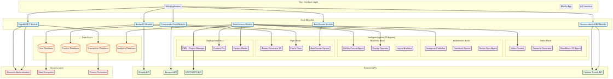

# System Architecture: TRYONYOU – ABVETOS – ULTRA–PLUS–ULTIMATUM

## Introduction

The TRYONYOU platform is designed as a modular, scalable, and interconnected ecosystem that seamlessly integrates various advanced technologies to deliver a comprehensive fashion intelligence solution. The architecture is built around a central core that communicates with a series of specialized modules, each responsible for a specific function. This modular approach allows for flexibility, easy maintenance, and future expansion.

## Architectural Diagram (Closed Loop System)

The following diagram illustrates the closed-loop architecture of the TRYONYOU system, where data and insights flow between modules to create a self-optimizing and intelligent platform.

## Core Modules Explained

Our architecture is composed of several core modules that form the backbone of the TRYONYOU platform.

| Module | Technology Stack | Key Responsibilities |
| --- | --- | --- |
| **Avatar 3D** | Three.js, WebGL, Computer Vision | - Generates photorealistic 3D avatars from user measurements. - Customizes avatar appearance, including face, hair, and body shape. - Provides a realistic canvas for virtual try-on. |
| **Fabric Fit Comparator** | Physics Engine (e.g., NVIDIA PhysX), ML Models | - Simulates fabric drape, stretch, and movement in real-time. - Analyzes garment fit based on avatar measurements and fabric properties. - Provides detailed fit analysis and recommendations. |
| **Smart Wardrobe** | AI/ML, Image Recognition, Database (PostgreSQL) | - Digitizes and catalogs users' existing clothing items. - Offers AI-powered outfit recommendations based on style, weather, and occasion. - Tracks clothing usage and provides insights. |
| **Solidarity Wardrobe** | Blockchain, Smart Contracts, API Integrations | - Facilitates the donation and exchange of pre-owned clothing. - Ensures transparency and traceability in the donation process. - Connects users with charitable organizations and recycling partners. |
| **ABVET Biometric Payment** | Biometric SDKs, Secure Enclave, Payment Gateway APIs | - Enables secure and frictionless payments using iris and voice recognition. - Protects user data with end-to-end encryption. - Integrates with major payment gateways. |
| **Fashion Trend Tracker (FTT)** | Big Data Analytics, NLP, Social Media APIs | - Monitors and analyzes fashion trends from social media, news, and e-commerce sites. - Provides brands and users with actionable insights and trend forecasts. - Identifies emerging styles, colors, and patterns. |
| **Creative Auto-Production (CAP)** | CAD/CAM Software, 3D Printing, API Integrations | - Automates the design-to-production workflow for on-demand manufacturing. - Generates production-ready files from virtual designs. - Integrates with manufacturing partners for seamless production. |
| **LiveIt Factory Orchestration** | IoT, Supply Chain Management Software, API Integrations | - Provides a centralized platform for managing and optimizing factory operations. - Tracks production status, inventory levels, and logistics in real-time. - Improves supply chain efficiency and reduces lead times. |

## Scalability and Performance

The TRYONYOU platform is built on a cloud-native infrastructure that ensures high availability, scalability, and performance. We leverage microservices architecture, containerization (Docker, Kubernetes), and serverless computing to handle fluctuating workloads and ensure a smooth user experience, even during peak demand.

