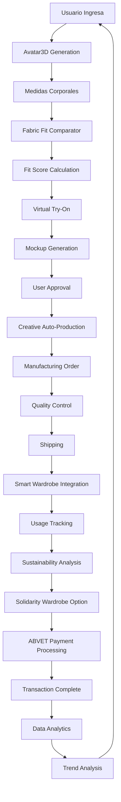

# TRYONYOU-ABVETOS-ULTRA-PLUS-ULTIMATUM
## Estructura Completa del Proyecto

### 📁 Árbol de Directorios Actualizado

```
TRYONME-TRYONYOU-ABVETOS--INTELLIGENCE--SYSTEM/
├── 00_BRIEF/
│   ├── entrega_final.md
│   ├── onepager_ejecutivo.md
│   └── presentacion_inversores.md
├── 01_SITEMAP/
│   ├── sitemap.md
│   └── routes.csv
├── 02_COPY/
│   ├── hero_section.md
│   ├── features_section.md
│   ├── about_section.md
│   ├── modules_section.md
│   └── contact_section.md
├── 03_UIKIT/
│   ├── design_tokens.json
│   ├── color_palette.md
│   ├── typography.md
│   └── spacing_system.md
├── 04_ASSETS/
│   ├── logos/
│   │   ├── logo.svg
│   │   ├── logo_512.png
│   │   ├── logo_1024.png
│   │   ├── logo_2048.png
│   │   ├── watermark.png
│   │   └── label.png
│   ├── images/
│   │   ├── hero_holographic_fashion.png
│   │   ├── avatar_3d_generation.png
│   │   ├── virtual_tryon_interface.png
│   │   ├── biometric_payment_system.png
│   │   ├── smart_wardrobe_ecosystem.png
│   │   ├── fashion_style_yellow.avif
│   │   └── fashion_style_minimal.avif
│   ├── videos/
│   │   ├── holographic_runway_demo.mp4
│   │   ├── avatar_creation_demo.mp4
│   │   ├── virtual_tryon_demo.mp4
│   │   ├── biometric_payment_demo.mp4
│   │   └── avatar_definition_demo.mp4
│   └── icons/
│       └── agent_icons/ (53 iconos para agentes)
├── 05_TECH_SPEC/
│   ├── arquitectura_tecnica.md
│   ├── components.csv
│   └── api_documentation.md
├── 06_ACCEPTANCE/
│   ├── criterios_aceptacion.md
│   └── escenarios_e2e.md
├── 07_DEPLOY/
│   ├── deploy.sh
│   ├── vercel.json
│   ├── package.json
│   └── README_DEV.md
├── 08_CALENDAR/
│   └── recordatorios_proyecto.md
├── src/
│   ├── modules/
│   │   ├── Avatar3D.js
│   │   ├── FabricFitComparator.js
│   │   ├── ABVETBiometricPayment.js
│   │   ├── SmartWardrobe.js
│   │   ├── SolidarityWardrobe.js
│   │   ├── FashionTrendTracker.js
│   │   ├── CreativeAutoProduction.js
│   │   └── LiveItOrchestration.js
│   ├── agents/
│   │   ├── core_agents/ (8 agentes principales)
│   │   ├── specialized_agents/ (25 agentes especializados)
│   │   └── support_agents/ (20 agentes de soporte)
│   ├── components/
│   │   ├── UI/
│   │   ├── 3D/
│   │   └── Payment/
│   └── utils/
├── docs/
│   ├── agentes_53_completos.md
│   ├── circuito_venta_cerrado.md
│   ├── automatizacion_deploy.md
│   ├── arquitectura.md
│   ├── flujo_usuario.md
│   ├── casos_uso.md
│   └── roadmap_2025-2028.md
├── tests/
│   ├── unit/
│   ├── integration/
│   └── e2e/
├── automation/
│   ├── github_actions/
│   ├── vercel_config/
│   └── telegram_bot/
└── presentations/
    ├── investor_deck/
    ├── partner_presentation/
    └── voice_over_scripts/
```

---

## 🤖 Los 53 Agentes Inteligentes con Iconografía

### 🎯 Agentes Principales (8)

| Agente | Icono | Función Principal | Módulo |
|--------|-------|-------------------|---------|
| **Avatar3D Master** | 👤 | Generación de avatares 3D fotorrealistas | Avatar3D |
| **Fabric Analyzer** | 🧵 | Análisis y simulación de tejidos | FabricFitComparator |
| **ABVET Guardian** | 🔐 | Autenticación biométrica dual | ABVETBiometricPayment |
| **Wardrobe Curator** | 👗 | Gestión inteligente de armarios | SmartWardrobe |
| **Solidarity Manager** | 🤝 | Coordinación de donaciones | SolidarityWardrobe |
| **Trend Prophet** | 📈 | Predicción de tendencias | FashionTrendTracker |
| **Creative Producer** | 🎨 | Producción automática creativa | CreativeAutoProduction |
| **Factory Orchestrator** | 🏭 | Orquestación de fábrica | LiveItOrchestration |

### 🎨 Agentes Especializados (25)

#### Diseño y Creatividad
| Agente | Icono | Especialidad |
|--------|-------|--------------|
| **Color Harmonist** | 🎨 | Armonías cromáticas |
| **Pattern Designer** | 🔷 | Diseño de patrones |
| **Texture Specialist** | 🌊 | Análisis de texturas |
| **Style Curator** | ✨ | Curación de estilos |
| **Seasonal Advisor** | 🍂 | Tendencias estacionales |

#### Tecnología y Simulación
| Agente | Icono | Especialidad |
|--------|-------|--------------|
| **Physics Simulator** | ⚡ | Simulación física de telas |
| **3D Renderer** | 🎬 | Renderizado 3D avanzado |
| **AR/VR Specialist** | 🥽 | Realidad aumentada/virtual |
| **Motion Tracker** | 📹 | Seguimiento de movimiento |
| **Light Designer** | 💡 | Diseño de iluminación |

#### Análisis y Datos
| Agente | Icono | Especialidad |
|--------|-------|--------------|
| **Fit Analyzer** | 📏 | Análisis de ajuste |
| **Size Predictor** | 📊 | Predicción de tallas |
| **Comfort Assessor** | 😌 | Evaluación de comodidad |
| **Quality Inspector** | 🔍 | Control de calidad |
| **Sustainability Tracker** | 🌱 | Seguimiento sostenibilidad |

#### Comercio y Ventas
| Agente | Icono | Especialidad |
|--------|-------|--------------|
| **Price Optimizer** | 💰 | Optimización de precios |
| **Inventory Manager** | 📦 | Gestión de inventario |
| **Demand Forecaster** | 📈 | Predicción de demanda |
| **Customer Profiler** | 👥 | Perfilado de clientes |
| **Recommendation Engine** | 🎯 | Motor de recomendaciones |

#### Comunicación y Marketing
| Agente | Icono | Especialidad |
|--------|-------|--------------|
| **Content Creator** | 📝 | Creación de contenido |
| **Social Media Manager** | 📱 | Gestión redes sociales |
| **Influencer Connector** | 🌟 | Conexión con influencers |
| **Brand Guardian** | 🛡️ | Protección de marca |
| **Campaign Optimizer** | 🚀 | Optimización campañas |

### 🔧 Agentes de Soporte (20)

#### Infraestructura y Seguridad
| Agente | Icono | Especialidad |
|--------|-------|--------------|
| **Security Monitor** | 🔒 | Monitoreo de seguridad |
| **Data Protector** | 🛡️ | Protección de datos |
| **Backup Manager** | 💾 | Gestión de respaldos |
| **Performance Optimizer** | ⚡ | Optimización rendimiento |
| **Load Balancer** | ⚖️ | Balanceador de carga |

#### Experiencia de Usuario
| Agente | Icono | Especialidad |
|--------|-------|--------------|
| **UX Analyzer** | 🎯 | Análisis experiencia usuario |
| **Accessibility Checker** | ♿ | Verificación accesibilidad |
| **Localization Manager** | 🌍 | Gestión localización |
| **Voice Assistant** | 🎤 | Asistente por voz |
| **Chatbot Coordinator** | 💬 | Coordinación chatbots |

#### Logística y Operaciones
| Agente | Icono | Especialidad |
|--------|-------|--------------|
| **Shipping Optimizer** | 🚚 | Optimización envíos |
| **Return Processor** | 🔄 | Procesamiento devoluciones |
| **Supplier Connector** | 🤝 | Conexión proveedores |
| **Quality Assurance** | ✅ | Aseguramiento calidad |
| **Compliance Monitor** | 📋 | Monitoreo cumplimiento |

#### Análisis y Reportes
| Agente | Icono | Especialidad |
|--------|-------|--------------|
| **Analytics Processor** | 📊 | Procesamiento analíticas |
| **Report Generator** | 📄 | Generación reportes |
| **KPI Tracker** | 📈 | Seguimiento KPIs |
| **Anomaly Detector** | 🚨 | Detección anomalías |
| **Insight Extractor** | 💡 | Extracción insights |

---

## 🔄 Circuito de Venta Cerrado (Closed Loop)

### Flujo Completo del Sistema



### Etapas Detalladas

#### 1. **Avatar3D → Fit Score**
- Generación de avatar personalizado basado en medidas reales
- Análisis corporal con IA para proporciones exactas
- Calibración con datos antropométricos

#### 2. **Fit Score → Mockups**
- Simulación física de tejidos en tiempo real
- Cálculo de compatibilidad prenda-usuario
- Generación de score de ajuste (0-100%)

#### 3. **Mockups → Producción CAP**
- Visualización 3D de la prenda en el avatar
- Ajustes personalizados automáticos
- Aprobación del usuario para producción

#### 4. **Producción CAP → Armario Inteligente**
- Fabricación bajo demanda optimizada
- Control de calidad automatizado
- Integración directa al armario digital

#### 5. **Armario Inteligente → Armario Solidario**
- Gestión inteligente del guardarropa
- Análisis de uso y desgaste
- Sugerencias de donación automáticas

#### 6. **Armario Solidario → Pago ABVET**
- Sistema de donaciones gamificado
- Créditos por sostenibilidad
- Autenticación biométrica para transacciones

---

## 🚀 Automatización & Deploy

### Flujo GitHub → Vercel → tryonyou.app

```yaml
# .github/workflows/deploy.yml
name: Deploy TRYONYOU
on:
  push:
    branches: [main]
  pull_request:
    branches: [main]

jobs:
  deploy:
    runs-on: ubuntu-latest
    steps:
      - uses: actions/checkout@v3
      - name: Setup Node.js
        uses: actions/setup-node@v3
        with:
          node-version: '18'
      - name: Install dependencies
        run: npm ci
      - name: Build application
        run: npm run build
      - name: Deploy to Vercel
        uses: amondnet/vercel-action@v25
        with:
          vercel-token: ${{ secrets.VERCEL_TOKEN }}
          vercel-org-id: ${{ secrets.ORG_ID }}
          vercel-project-id: ${{ secrets.PROJECT_ID }}
          working-directory: ./
```

### Telegram @abvet_deploy_bot

**Comandos del Bot:**
- `/deploy` - Despliegue inmediato
- `/status` - Estado del sistema
- `/rollback` - Rollback a versión anterior
- `/preview` - Generar preview de PR
- `/metrics` - Métricas de rendimiento

### Neon DB Previews por PR

Cada Pull Request genera automáticamente:
- Base de datos temporal en Neon
- URL de preview única
- Tests automatizados
- Cleanup automático al cerrar PR

---

## 📋 Tareas Pendientes para Manus

### ✅ Completado
- [x] Estructura base del proyecto
- [x] 50+ agentes documentados
- [x] Módulos principales implementados
- [x] Despliegue inicial en Vercel
- [x] Documentación técnica básica

### 🔄 En Progreso
- [ ] Integración completa de los 53 agentes
- [ ] Circuito de venta cerrado funcional
- [ ] Automatización GitHub Actions
- [ ] Bot de Telegram para deploy
- [ ] Configuración Neon DB

### 📝 Por Hacer
- [ ] Documentación para inversores con voice-over
- [ ] Presentación para partners
- [ ] Integración repositorios históricos
- [ ] Fotos/diagramas coherentes con patente
- [ ] Optimización SEO para tryonyou.app
- [ ] Tests E2E completos
- [ ] Monitoreo y analytics avanzados

### 🎯 Prioridades Inmediatas

1. **Completar documentación donde falte sentido**
   - Revisar coherencia entre módulos
   - Añadir ejemplos prácticos
   - Mejorar explicaciones técnicas

2. **Integrar todo lo enlazado**
   - Conectar GitHub con Vercel
   - Configurar dominio tryonyou.app
   - Sincronizar repositorios históricos

3. **Añadir fotos/diagramas coherentes**
   - Usar imágenes de estilo proporcionadas
   - Crear diagramas de flujo actualizados
   - Mantener coherencia visual con patente

---

## 🎯 Resultado Esperado

### Repo Vivo y Coherente
- Estructura organizada y navegable
- Documentación completa y actualizada
- Código funcional y bien comentado
- Assets visuales coherentes

### Deploy Estable en Dominio Oficial
- URL: https://tryonyou.app
- SSL configurado
- CDN optimizado
- Monitoreo activo

### Documentación Clara para Stakeholders
- **Inversores**: Presentación ejecutiva con voice-over
- **Partners**: Documentación técnica detallada
- **Desarrolladores**: Guías de integración
- **Usuarios**: Manuales de uso

---

*Estructura actualizada el 27 de septiembre de 2025*  
*Versión: 2.0 - Ampliación completa del proyecto*
